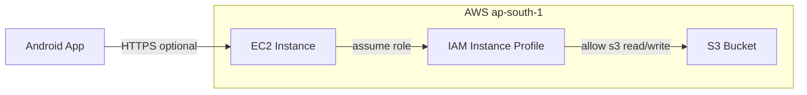

# Production Deployment Plan (Budget-Conscious)

## Current Stack Summary

- **Backend**: Spring Boot 3.3.4, Java 21, Gradle; port 8080; S3 (ap-south-1, bucket `teacherplatform.503561455300`) for PDFs; PostgreSQL for catalog.
- **Android**: Native Kotlin app; API base URL currently hardcoded in [AppConstants.kt](android/app/src/main/java/com/maths/teacher/app/config/AppConstants.kt) as `http://10.0.2.2:8080/`.
- **Database**: PostgreSQL 16; schema in [docker/init/001_init.sql](backend/docker/init/001_init.sql).

---

## 1. Backend on EC2 with S3 Access

**Goal**: Run the backend JAR on an EC2 instance in the same region as your S3 bucket (ap-south-1), with secure access to the bucket and no hardcoded AWS keys.

**Architecture (high level)**:

**Steps**:

1. **IAM**

   - Create an IAM role for EC2 with a policy that allows the required S3 actions on `teacherplatform.503561455300` (e.g. `s3:GetObject`, `s3:ListBucket`; add `s3:PutObject` if admin uploads PDFs from this backend).
   - Attach this role to the EC2 instance (instance profile). The backend already uses the default credential chain ([S3Config.java](backend/src/main/java/com/maths/teacher/storage/S3Config.java)), so no code changes are needed for S3 auth.

2. **EC2**

   - Launch an instance in **ap-south-1** (e.g. **t3.micro** or **t4g.micro** for lowest cost; t4g if you prefer ARM).
   - AMI: Amazon Linux 2023 or Ubuntu 22.04.
   - Attach the IAM role above.
   - Security group: allow SSH (22) from your IP; allow **8080** (or 443 if you put a reverse proxy in front) from **0.0.0.0/0** so the app can reach the API.
   - Allocate an **Elastic IP** and associate it so the API URL does not change on restart.

3. **Runtime on EC2**

   - Install Java 21 (e.g. `amazon-corretto-21` or OpenJDK 21).
   - Build the JAR locally or in CI: `./gradlew -p backend clean build -x test`; copy `backend/build/libs/*.jar` to EC2.
   - Run with environment variables (no secrets in repo):
     - `SPRING_DATASOURCE_URL`, `SPRING_DATASOURCE_USERNAME`, `SPRING_DATASOURCE_PASSWORD` (point to the chosen DB; see section 3).
     - `APP_STORAGE_S3_REGION=ap-south-1`, `APP_STORAGE_S3_BUCKET=teacherplatform.503561455300`, `APP_STORAGE_S3_PRESIGN_EXPIRY_MINUTES=10`.
   - Option A (simple): run with `java -jar app.jar` and a process manager (e.g. systemd service). Option B: run the same JAR inside Docker on EC2 if you prefer containerization; your existing [Dockerfile](backend/Dockerfile) is fine, pass the same env vars at runtime.

4. **HTTPS (optional, low cost)**

   - If you have a domain: install Nginx (or Caddy) on EC2, use Let’s Encrypt (e.g. certbot) for a free certificate, and reverse-proxy to `localhost:8080`. Then open only 80/443 in the security group and block direct 8080 from the internet if desired.
   - If you do not have a domain: the Android app can call `http://<Elastic-IP>:8080` for a minimal setup (Play Store allows cleartext if you use `android:usesCleartextTraffic` or a network security config; prefer HTTPS when possible).

**Budget**: EC2 t3.micro/t4g.micro is low cost; Elastic IP is free while attached. S3 and data transfer are pay-per-use and typically small for a teacher app.

---

## 2. Android App on Google Play Store

**Goal**: Ship the app to production with the correct API URL and Play Store compliance.

**Steps**:

1. **API URL for production**

   - Right now [AppConstants.kt](android/app/src/main/java/com/maths/teacher/app/config/AppConstants.kt) has a single `BASE_URL = "http://10.0.2.2:8080/"`. Introduce a per-build URL so release builds hit production.
   - In [app/build.gradle.kts](android/app/build.gradle.kts), enable `buildFeatures.buildConfig = true` and add a `buildConfigField` in `defaultConfig` and in `release` (e.g. `"BASE_URL", "String", "\"https://your-api.example.com/\""` or `"http://<Elastic-IP>:8080/"`). Read `BuildConfig.BASE_URL` in [ApiClient.kt](android/app/src/main/java/com/maths/teacher/app/data/api/ApiClient.kt) instead of `AppConstants.BASE_URL` (keep a debug default in `defaultConfig`).
   - Alternatively use a single `buildConfigField` in `release` and leave debug with `10.0.2.2:8080`.

2. **Release build and signing**

   - Create a keystore and a release key (keep backups and passwords secure).
   - In `app/build.gradle.kts`, add `signingConfigs` (reference the keystore) and set `release.signingConfig` to that config.
   - Build an **Android App Bundle (AAB)**: `./gradlew :app:bundleRelease`; output: `app/build/outputs/bundle/release/app-release.aab`. Play Store requires AAB for new apps.

3. **Play Console**

   - Pay the one-time **$25** developer registration fee.
   - Create an app, fill store listing (short/long description, screenshots, icon, privacy policy if you collect data).
   - In Release > Production (or testing track), upload the AAB and complete content rating and any required forms (e.g. data safety).
   - Ensure **targetSdk** (currently 34) meets Play’s requirements for new apps.

**Budget**: $25 one-time; no recurring cost for the store listing.

---

## 3. Database Deployment (You Had Not Decided)

You need a PostgreSQL host that the backend on EC2 can reach. Here are three options, from lowest to higher cost and operational lift.

| Option | Where | Typical monthly cost | Pros | Cons |

|--------|--------|------------------------|------|------|

| **A. Same EC2** | PostgreSQL in Docker (or native) on the same EC2 instance | $0 extra | Cheapest, simple | Single point of failure; backups and upgrades are your responsibility |

| **B. RDS PostgreSQL** | AWS RDS in ap-south-1 | Free tier (db.t4g.micro, 12 months) then ~$15–20/mo | Managed, backups, high availability options | Slightly higher cost after free tier |

| **C. External managed** | Neon, Supabase, or similar | Free tier often sufficient | Managed, often free tier; can be in same region | Data and app outside single AWS account; ensure region/latency is acceptable |

**Recommendation for tight budget**:

- **Short term / minimal cost**: **Option A** — run PostgreSQL in a container (or install from package) on the same EC2. Use your existing [docker-compose](backend/docker-compose.yml) as reference: run only the `db` service on EC2, and point the backend’s `SPRING_DATASOURCE_URL` to `jdbc:postgresql://localhost:5432/teacher_videos`. Add a cron or script to dump the DB to S3 periodically for backups.
- **If you want managed DB with minimal cost**: **Option B** — RDS **db.t4g.micro** (PostgreSQL 16) in ap-south-1, in a private subnet if you use a VPC; allow the EC2 security group in the RDS security group. Use the same schema/init script you already have.
- **If you prefer a third-party managed Postgres**: **Option C** — e.g. Neon free tier; create the DB, run your init SQL, and set `SPRING_DATASOURCE_*` on EC2 to that connection string (use SSL if required).

**Backend change**: Regardless of option, keep DB credentials and URL in environment variables (no defaults to localhost in `application.yml` for production, or override via env). Your app already supports this via Spring’s env-override.

---

## 4. Order of Operations and Checklist

1. **Database**: Choose option A, B, or C; create DB and run [001_init.sql](backend/docker/init/001_init.sql) (and [data.sql](backend/src/main/resources/data.sql) if you use it).
2. **EC2**: Launch instance, attach IAM role for S3, install Java 21, deploy JAR (or Docker), set env vars (DB + S3), open port 8080 (and 80/443 if using HTTPS).
3. **Android**: Add `BuildConfig.BASE_URL` and point release to `http(s)://<EC2-public-IP-or-domain>/`; configure release signing; build AAB.
4. **Play**: Register developer account, create app, upload AAB, complete listing and policies, submit for review.

**Security**: Do not commit DB passwords or AWS keys. Use IAM roles for S3. Prefer HTTPS for the API before or soon after launch.

---

## 5. Rough Monthly Cost (AWS, Indicative)

- **EC2** t3.micro (or t4g.micro): ~\$8–10 (or free tier for 12 months if eligible).
- **Elastic IP**: \$0 while attached.
- **S3**: \$1–5 for small storage and requests (depends on usage).
- **RDS** (if Option B, after free tier): ~\$15–20.
- **Data transfer**: Usually a few dollars for a small app.

**Minimal setup (EC2 + PostgreSQL on same EC2 + S3)**: on the order of **\$10–15/month** (or less with free tier). Adding RDS (Option B) after free tier adds roughly **\$15–20/month**.